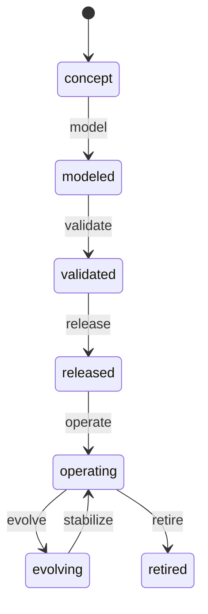

# Twin lifecycle

```dsl
DOCUMENT TWIN_LIFECYCLE
VERSION 2
LANGUAGE EN
MODE STRICT
LIFECYCLE_SCHEMA = "wellmanifest.twin-lifecycle/v1"
REQUEST_GRAMMAR = "twin-lifecycle.v1.gbnf"
BLUEPRINT = "../standard/blueprint.examples.json"
```

## Responsibility

This module owns the stage lifecycle of one Digital Twin aggregate: which
stages exist, which transitions are declared, what evidence a transition
requires, who may approve it and what a transition receipt records.

It does not own the twin's contract (`subactor/twin` owns the profile,
protobuf and transport bindings), the module graph (`subactor/modularity`),
the process runtime, the event store or any authority decision. A lifecycle
document reports that declared criteria were evaluated. It never mints
execution authority, never carries secrets or shell input and never turns a
score, proposal, simulation or model verdict into evidence.

The `wellmanifest.twin-lifecycle/v1` blueprint is the missing definition
behind `LifecycleBlueprintRef.definition_uri` and
`definition_digest_sha256` in the Twin Standard. A twin profile asserts
lifecycle *policy*; this standard supplies the *stage graph* that policy is
evaluated against.

## Document families

| Kind | Written by | Purpose |
| --- | --- | --- |
| `lifecycle-blueprint` | contract review | immutable stage graph, criteria, roles |
| `transition-request` | model or caller (GBNF-constrained) | one bounded transition intent |
| `lifecycle-state` | projection rebuild | observe-only current stage |
| `transition-receipt` | controller | redacted, event-bound outcome |

A blueprint is content-addressed. Every request, state and receipt carries a
`blueprintRef` whose `definitionDigest` equals `sha256:` over the canonical
blueprint JSON, so a document can only be interpreted against the exact
revision it was resolved with. A changed blueprint is a new version, never an
edit of `/v1`.

## Reference blueprint



```dsl
STATE concept
STATE modeled
STATE validated
STATE released
STATE operating
STATE evolving
STATE retired

INITIAL_STAGE = concept
REPEATABLE_STAGES = [operating, evolving]
TERMINAL_STAGES = [retired]

TRANSITION concept -> modeled WHEN ACTION = model
TRANSITION modeled -> validated WHEN ACTION = validate
TRANSITION validated -> released WHEN ACTION = release AND APPROVER_ROLE IN [role:release-approver]
TRANSITION released -> operating WHEN ACTION = operate AND APPROVER_ROLE IN [role:owner]
TRANSITION operating -> evolving WHEN ACTION = evolve AND APPROVER_ROLE IN [role:change-approver]
TRANSITION evolving -> operating WHEN ACTION = stabilize AND APPROVER_ROLE IN [role:change-approver]
TRANSITION operating -> retired WHEN ACTION = retire AND APPROVER_ROLE IN [role:owner]

RULE TWINLC-RESOLVE-001 TYPE REQUIRED
WHEN TRANSITION_REQUESTED
DO REQUIRE (ACTION, FROM_STAGE, TO_STAGE) IN PINNED_BLUEPRINT_TRANSITIONS
DO REQUIRE EVIDENCE_REFERENCE_FOR_EACH_REQUIRED_CRITERION
FORBID CARRY_AUTHORITY_REFERENCE_IN_REQUEST
FORBID APPROVE_BY_TWIN_PERSONA
ASSERT RECEIPT_AUTHORITY_GRANTED = false
```

The reference blueprint is one conforming instance, not the standard. A twin
may tailor stages and actions; the graph rules below apply to every blueprint.
`service-observe-repair/v1` is the second instance: it is how a service twin
is validated and then repaired one adjacent stage at a time. See
[`VALIDATE_AND_REPAIR.md`](VALIDATE_AND_REPAIR.md).

## Blueprint graph rules

- stage identities are unique; the initial stage is never a transition target;
- at least one terminal stage exists; a terminal stage has no outgoing
  transition and no exit criteria;
- every non-terminal stage has an outgoing transition and every stage is
  reachable from the initial stage;
- a transition never targets its own stage; `(action, from, to)` triples are
  unique and every action name is unique;
- a feedback transition — one whose target is declared at or before its source
  — is accepted only when the target stage is `repeatable`, which is how a
  repeatable evolution loop is expressed without an unbounded cycle;
- a transition's `requiredCriteria` must be a subset of the source stage's
  `exitCriteria` united with the target stage's `entryCriteria`, so a gate can
  never demand a criterion no stage declares;
- every transition is `failClosed`; approver roles must be declared by the
  blueprint.

## Fail-closed resolution

A transition request resolves only when an exactly declared
`(action, fromStage, toStage)` triple exists in the pinned blueprint. An
unmentioned transition is rejected before any repository or twin mutation.
The request grammar deliberately does not enumerate actions or stages: those
are blueprint-defined identifiers, and the controller — not the grammar — is
the fail-closed boundary. This is the one structural difference from
`ticket-lifecycle`, whose action set is fixed by its own domain.

## Evidence, approval and authority

`evidenceRefs` are `evidence://…/rN` pointers to observations that a separate
boundary authenticated. A request needs at least one evidence reference per
required criterion. A score, proposal, simulation, generated artifact or model
verdict is not an evidence scheme and is rejected by reference shape.

Approval and authority are separate concerns and separate fields. A request
cannot carry an authority reference at all — the field is outside the closed
contract. A receipt asserts `authorityGranted: false` by construction: an
approved gate confirms the declared criteria were evaluated, and an effectful
command must still obtain authority elsewhere. An approver is a `human` or
`service` actor in a role the transition declares; a `twin-persona` may
request a transition but can never approve one, including its own.

## Statuses and receipts

`REQUESTED`, `APPROVED`, `BLOCKED` and `REJECTED` match the Twin Standard's
`LifecycleTransitionStatus`. `BLOCKED` and `REJECTED` record non-empty
`unmetCriteria` and no approver. `APPROVED` records no unmet criteria,
evidence for every required criterion, at least one `event://` reference —
transitions are event-backed — and, where the transition declares approver
roles, both an approver in an accepted role and a `decision://` gate record.

## Replay

`lifecycle-state` is a projection: `derivedFrom` is always `event-stream` and
`replayExecutedEffects` is always false. Rebuilding it must not approve,
reject or advance a stage, and a blueprint declares
`replayExecutesTransitions: false`.

## Native Rust Runtime and Anti-Tamper Isolation

High-performance digital twin sandboxing requires sub-second instantiation,
CoW filesystem isolation, and defense against runtime reverse engineering:
- **Rust Core Execution:** Stripped native ELF binaries (`twinerd`, `clonerd-twin`)
  with Tokio async I/O and RFC 8628 pairing.
- **OverlayFS Copy-on-Write:** Ephemeral upper directories for instant (<50ms)
  creation and atomic zero-residue teardown.
- **Runtime Anti-Debug Guard:** Process introspection (`TracerPid != 0`) and
  C-ABI guard interface (`libtwinerd_guard.so`) with hardware DRM node binding
  under `Tomasz Sapletta Prototypowanie.pl`.
- See [`NATIVE_RUST_TWIN_AND_ANTI_TAMPER.md`](NATIVE_RUST_TWIN_AND_ANTI_TAMPER.md).

## Diagnostics

| Code | Meaning |
| --- | --- |
| `TWINLC-DOC-001` | Document family or closed field set is invalid; an undeclared field (for example an authority reference in a request) was present. |
| `TWINLC-REF-001` | A reference is malformed, duplicated or of a forbidden scheme. |
| `TWINLC-BLUEPRINT-001` | Blueprint immutability, identity or revision binding is violated. |
| `TWINLC-GRAPH-001` | Stage graph, criteria contract, repeatability or approver-role declaration is unsafe. |
| `TWINLC-TRANSITION-001` | The requested transition is not declared by the pinned blueprint. |
| `TWINLC-EVIDENCE-001` | Evidence sufficiency, unmet-criteria or event-backing semantics are violated. |
| `TWINLC-AUTHORITY-001` | Approval was treated as authority, or an approver is not accepted. |
| `TWINLC-REPLAY-001` | Replay or projection semantics are not observe-only. |
| `TWINLC-SECRET-001` | The secret-free key or grammar-surface rule is violated. |
| `TWINLC-SEQUENCE-001` | A sequential blueprint declared a skip-ahead forward transition. |

`standard/conformance.py --all` proves each code against an adversarial
mutation and pins the schema and grammar digests. Exit status is `0` when the
whole suite holds and non-zero on any contract violation.
