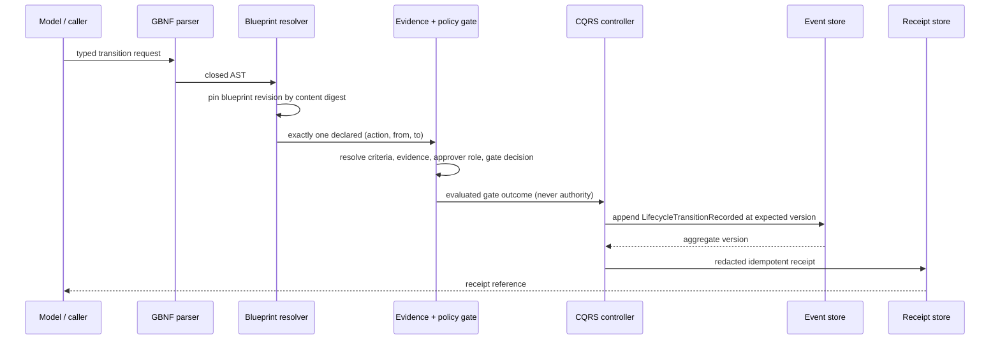

# Twin lifecycle logic flow

The blueprint is resolved before anything else. A document whose
`blueprint.definitionDigest` does not equal the canonical digest of the pinned
definition is rejected without evaluating its content, so a request can never
be interpreted against a blueprint revision it was not written for.

Resolution is fail-closed. Only an exactly declared `(action, fromStage,
toStage)` triple continues; an unmentioned transition, a stage the blueprint
does not declare, or a criterion outside the stage entry/exit contract rejects
before any event is appended.

The gate is descriptive. It reports `APPROVED`, `BLOCKED` or `REJECTED` for the
declared criteria and cannot dispatch a command, call a connector or grant
authority. An effectful command that follows an approved gate obtains its
authority from a separate boundary and carries its own idempotency key.

Rebuilding `lifecycle-state` from the event stream is observation only. It
does not re-approve, re-reject or advance a stage, and `evolving → operating`
is a declared feedback transition into a `repeatable` stage — not a replayed
one.

`(twinRef, idempotencyKey)` identifies one transition attempt. Replaying the
same request must return the same receipt rather than a second mutation; a
replay whose content changed is rejected.
